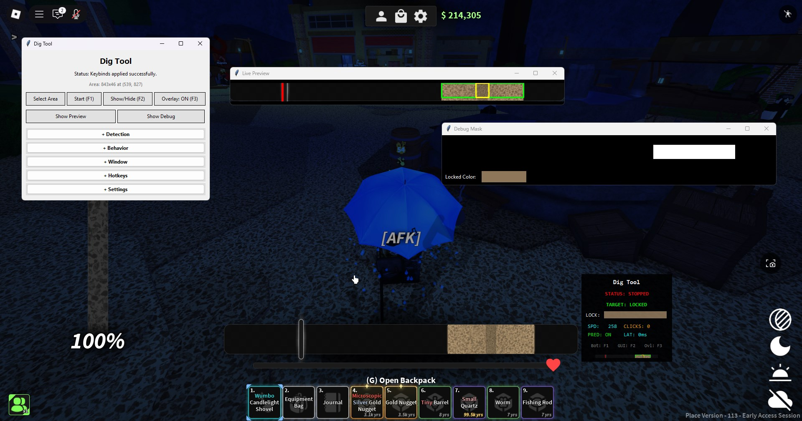

  
<h1>Dig Tool</h1>
  

A highly configurable automation tool specifically for the ROBLOX game ["Dig"](https://www.roblox.com/games/126244816328678) where several algorithms are used in order achieve accuracy during the minigame.

> [!NOTE]
> If in any circumstances tools like these become *banned* by Dig staff, this repository and its contents will be archived.

## Installation 

### Option 1: Quick Start (Recommended)
- Download the pre-compiled executable from the releases page
- No Python installation required - just run the .exe file

### Option 2: Run from Source
- Clone this repository: `git clone https://github.com/iamnotbobby/dig-tool`
- Install dependencies: `pip install -r requirements.txt`
- Run the application: `python main.py`

> [!NOTE]
> Option 1 is recommended for most users as it requires no technical setup and comes with a performance boost due to it's compilation nature. Choose Option 2 if you want to modify the code or prefer running from source.
## Technical Overview

### How It Works

The tool captures the screen continuously and analyzes each frame to find moving lines and colored zones. When it detects a line moving toward the target area, it calculates where the line will be in the future and attempts to click precisely inb the middle of the colored zone.

### Detection Process

1. **Setup**: The user selects an area on the screen, in this case, it would be the minigame's bar itself
2. **Zone Finding**: Automatically detects colored target zones within the bar. The color found is then used to "lock" the color for better tracking
3. **Line Tracking**: Continuously scans for vertical lines using edge detection
4. **Speed Calculation**: Tracks how fast and in which direction the line is moving in order to perform predictive clicking

This tool is meant to perform its detection tasks with minimal delay and minimal resource usage.

## Contribution

Feel free to contribute by opening a PR!
